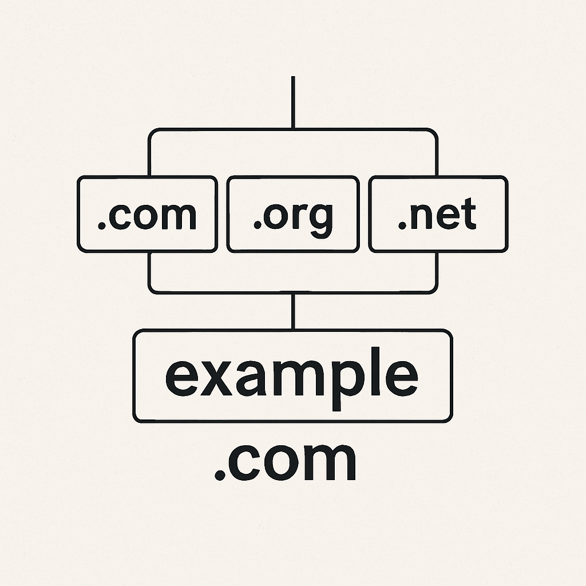

# Dominio 

## ¿Qué es un dominio?

Un **dominio** es el nombre único y legible por humanos que se utiliza para identificar un sitio o servicio en internet. Funciona como una dirección fácil de recordar que se traduce internamente a una dirección IP del servidor que aloja tu aplicación.

**Ejemplo:**
- Dominio: `www.ejemplo.com`
- IP asociada: `93.184.216.34`

## Estructura de un dominio

Ejemplo: `api.misitio.com`

- `com`: Dominio de nivel superior (TLD)
- `misitio`: Nombre del dominio (registrado por el usuario)
- `api`: Subdominio (opcional)

    

## ¿Por qué es importante un dominio?

### 1. Accesibilidad
Permite a los usuarios acceder fácilmente a tu sistema sin memorizar direcciones IP.

### 2. Seguridad (HTTPS)
Para habilitar certificados SSL y cifrar la conexión (HTTPS), necesitas un dominio.

## Como se puede conseguir un dominio?
Se pueden conseguir en sitios como:

- [Namecheap](https://www.namecheap.com/)
- [GoDaddy](https://www.godaddy.com/)
- [Cloudflare Registrar](https://www.cloudflare.com/products/registrar/)
- [Google Domains (Squarespace)](https://domains.google)

> Ejemplo de dominio registrado: `shadedcitadel.xyz`

---

## Acceso al panel DNS del registrador

Debes poder acceder al panel donde se administran los **registros DNS** del dominio. Este panel puede llamarse:

- "DNS Management"
- "Zone Editor"
- "Advanced DNS Settings"

Desde allí podrás crear o editar registros tipo A, CNAME, TXT, etc.

---

## Limpiar registros predeterminados (si existen)

Muchos dominios nuevos vienen con configuraciones por defecto que **debes revisar o eliminar** para evitar conflictos.

- Verifica los registros tipo **A** y **CNAME**
- Elimina entradas innecesarias para `@` o `www` si no las vas a usar
- Asegúrate de tener el control total del enrutamiento del dominio
