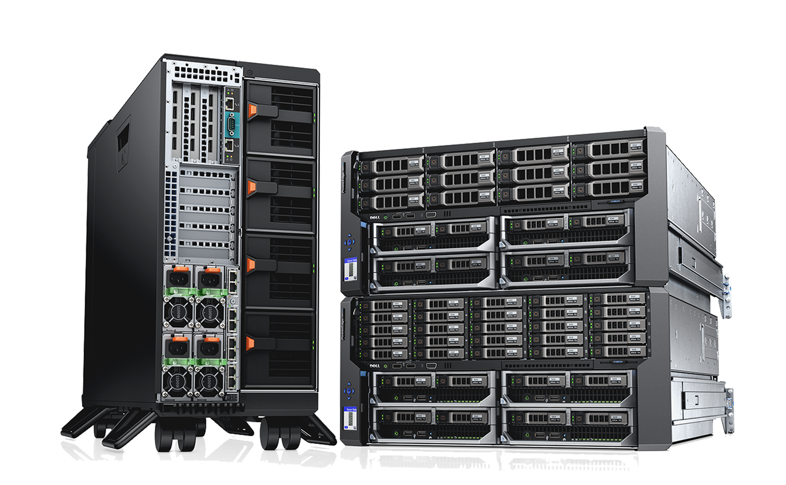
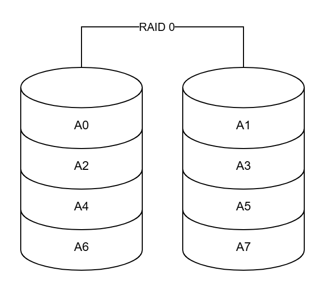
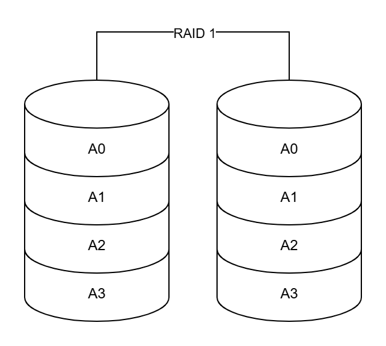
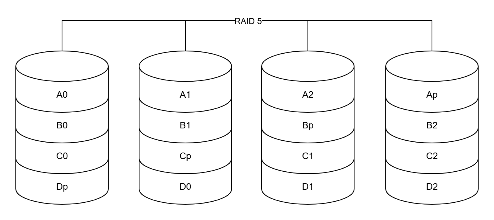
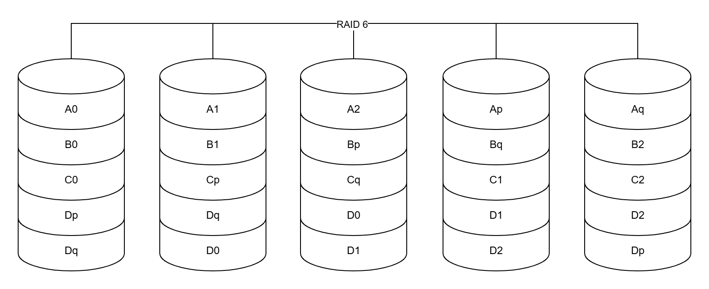
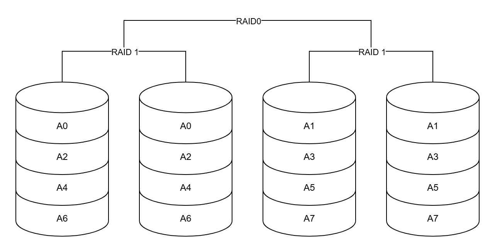
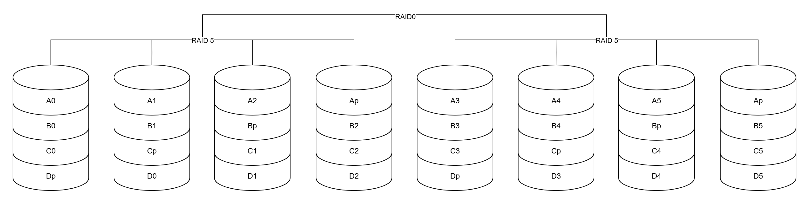
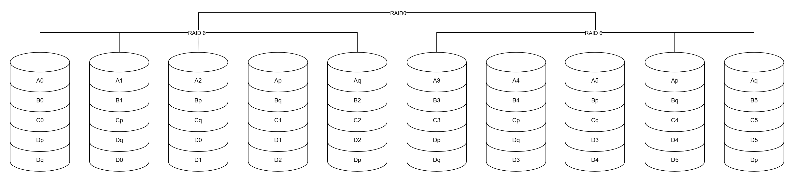
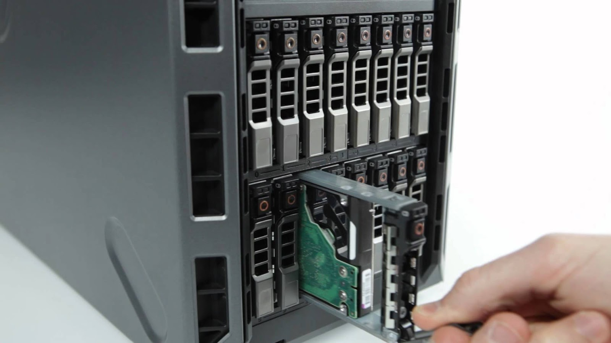
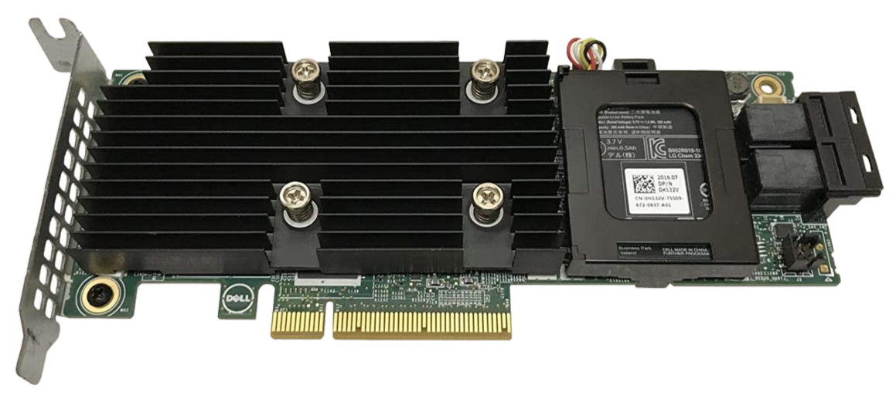

# RAID {:#raid}

RAID es un término utilizado en informática, cuyas siglas vienen del inglés *Redundant Array of Independent Disks* o *Matriz Redundante de Discos Independientes* [[1](#xataka-raid)], es un proceso utilizado para combinar varios discos duros y que estos funcionen de manera coordinada para formar una única unidad lógica en la que almacenar los datos. El objetivo principal de RAID es mejorar el rendimiento, la disponibilidad y la seguridad de los datos almacenados.

A nivel empresarial, es muy utilizado a la hora de configurar el almacenamiento de servidores NAS y aplicaciones. Ofrece mayor tolerancia a fallos y más altos niveles de rendimiento que un solo disco duro o un grupo de discos duros independientes.

    
    <i>Servidor configurado con RAID</i>

## Tipos de RAID {:#tipos-de-raid}

Algunos de los términos importantes que conviene conocer son:

- **Datos de paridad**: Estos se distribuyen entre todos los discos físicos en el sistema. Si un disco físico falla, es posible reconstruirlo desde la paridad y los datos de los discos físicos restantes. Los datos de paridad están presentes en RAID 5, 6, 50 y 60.
- **Modo Degradado**: Ocurre cuando uno de los discos del RAID se vuelve ilegible, el disco entonces es considerado corrupto y se extrae del RAID. Los datos y la paridad del disco son almacenados en los discos restantes. Este proceso degrada en gran medida el rendimiento del RAID.

Básicamente, tenemos dos tipos de configuraciones, como son las siguientes [[2](#hard-zone-raid)]:

- **Disk mirroring**: Es un tipo de configuración RAID que busca redundancia de datos ante un posible fallo en una de las unidades de almacenamiento, duplicando los datos en dos o más discos. Si uno de los discos falla, el sistema puede seguir funcionando con el otro disco sin pérdida de datos.
- **Disk stripping**: Esta configuración RAID que no busca redundancia, sino conseguir mayores velocidades de transferencia de datos, repartiendo los datos entre varios discos.

> [!NOTE]
> Los tipos de RAID más utilizados en servidores son el RAID1, RAID5, RAID 6 y RAID 10.

### RAID 0 {:#raid0}

    
    <i>RAID 0</i>

Se necesitan mínimo 2 discos. Cuenta la suma de tamaños de todos los discos duros. Un RAID 0, emplea *striping* y reparte los datos en bloques entre los discos, de forma que cada bloque se almacena en un disco diferente. Por ejemplo, si tenemos 4 discos de 1 TB cada uno, tendremos 4 TB disponibles.

> [!IMPORTANT]
> Se empleará como tamaño de bloque el más pequeño de los discos, por lo que si tenemos 4 discos de 1 TB, 2 de 500 GB y 1 de 250 GB, el tamaño de bloque será de 250 GB.

El inconveniente es que **no hay redundancia y tolerancia a fallos**, por lo que cualquier fallo o avería en uno de los discos conlleva una pérdida total de los datos.

Sin embargo, ofrece un alto rendimiento en lectura y escritura, ya que los datos se distribuyen entre los discos, permitiendo que las operaciones de lectura y escritura se realicen en paralelo [[1](#xataka-raid)].

### RAID 1 {:#raid1}

    
    <i>RAID 1</i>

Se necesitan mínimo 2 discos. Es conocido como *espejo* o *mirroring*. Duplica todos los datos de la primera unidad de forma sincronizada a una segunda unidad de almacenamiento. De esta forma, si el primer disco se estropea, el sistema seguirá funcionando y trabajando con el segundo disco sin problemas y sin perder datos.

> [!IMPORTANT]
> Al igual que en el RAID 0, se empleará como tamaño de bloque el más pequeño de los discos, por lo que si tenemos 4 discos de 1 TB, 2 de 500 GB y 1 de 250 GB, el tamaño de bloque será de 250 GB.

Ofrece una **rápida recuperación tras un fallo de la unidad**, por tanto, es una de las mejores configuraciones en cuanto a redundancia y tolerancia a fallos. Además, disponemos de un mayor rendimiento de lectura/escritura, puesto que es posible escribir y leer de los dos discos al mismo tiempo.

### RAID 5 {:#raid5}

    
    <i>RAID 5</i>

Se necesitan como mínimo 3 discos, y se puede romper un disco sin perder los datos. Suele ser el RAID más usado en servidores, ya que aporta la velocidad y rendimiento del RAID 0 (uso eficiente de la unidad, alto rendimiento en escritura y lectura) y la seguridad del RAID 1 ante la pérdida de datos.

> [!IMPORTANT]
> El espacio disponible será de N-1, siendo N el número de discos del raid. Si utilizamos 5 discos de 1 TB tendremos: `5 discos – 1 = 4 discos -> 4 TB disponibles.`

Utiliza la paridad para recuperar los datos. Se dividen los datos en bloques en los diferentes discos, de forma que si hay un fallo en uno de ellos, esa parte de los datos se subsana con los datos almacenados en el resto de los discos, permitiendo al usuario continuar (aunque funciona más lento) con su trabajo.

### RAID 6 {:#raid6}

    
    <i>RAID 6</i>

Se necesitan como mínimo 4 discos. Puede tolerar dos fallos de discos duros (N-2).

Es similar al RAID 5 e incluye un disco de reserva que entra en funcionamiento una vez que uno de los discos se estropea (en este caso hasta que sustituimos el disco averiado, a todos los efectos tenemos un RAID 5). Proporciona, por tanto, una elevada redundancia de datos y rendimiento de lectura.

### RAID 10 (RAID 1 + RAID 0) {:#raid10}

    
    <i>RAID 10</i>

RAID 10, también conocido como **RAID 1 + 0**, es una configuración avanzada que combina espejo y distribución de datos para ofrecer alta seguridad y rendimiento simultáneamente. Funciona agrupando discos duros en pares espejo (RAID 1), donde cada disco tiene una copia idéntica del otro, y luego distribuyendo esos pares en paralelo (RAID 0) para acelerar las operaciones de lectura y escritura. Esto permite que el sistema siga funcionando incluso si falla un disco por cada par, lo cual brinda excelente tolerancia a fallos y tiempos de recuperación rápidos. Aunque solo se aprovecha la mitad del espacio total, debido al espejo, la velocidad es comparable a configuraciones enfocadas exclusivamente en rendimiento.

### RAID 50 (RAID 5 + RAID 0) {:#raid50}

    
    <i>RAID 50</i>

Se necesitan como mínimo 6 discos, con la posibilidad de que se puedan estropear hasta 3 discos sin perder datos. Se hace un RAID 5 y sobre ellos un RAID 0. Con el RAID 50 conseguiremos un volumen muy robusto, un mayor rendimiento de lectura en comparación con el RAID 5 estándar, y un rendimiento de escritura de medio a alto. Presenta las mismas desventajas que el RAID 5 (impacto medio ante los fallos de disco y tiempos de reconstrucción más largos al ser necesario volver a calcular la paridad), y un precio más elevado.

Tiene como tolerancia a fallos de 1 disco por cada grupo de discos RAID 5, lo que significa que si se falla un disco en un grupo, el sistema puede seguir funcionando sin pérdida de datos. Asimismo, el rendimiento de lectura es alto, ya que los datos se distribuyen entre múltiples discos, permitiendo que las operaciones de lectura se realicen en paralelo.

### RAID 60 (RAID 6 + RAID 0) {:#raid60}

    
    <i>RAID 60</i>

Se necesitan como mínimo 8 discos, con la posibilidad de que se puedan estropear hasta 4 discos sin perder datos, 2 por cada grupo de discos RAID 6. Es una configuración avanzada que combina la redundancia del RAID 6 con la velocidad del RAID 0, ofreciendo una alta tolerancia a fallos y un rendimiento optimizado. Se hace un RAID 6 y sobre ellos un RAID 0. Obtenemos un alto rendimiento sobre todo en tareas de lectura. Las desventajas son las mismas a las del RAID6 (rendimiento más bajo en escritura debido a los dos cálculos de paridad, y mayor gasto en hardware).

## Hot Swap {:#hot-swap}

El Hot Swap es una técnica permite sustituir el disco averiado por uno nuevo, sin necesidad de desconectar o apagar el servidor, para luego poder reconstruir la información.

	
	<i>Hot Swap</i>

Podemos dejarlo configurado de 2 formas:

1. Tenemos el disco duro de reserva cargado en el RAID, aunque sin utilizar, de manera que si tenemos un fallo de disco duro automáticamente empieza a reconstruir los datos en el disco que teníamos preparado (RAID 6).
2. No tenemos el disco insertado en el servidor, pero tenemos la capacidad de sustitución en caliente. Esta es una opción algo más arriesgada, que implica tener lo más cerca posible un disco de reserva y reemplazarlo lo antes posible antes de que falle una segunda unidad.

## Controladoras RAID {:#controladoras-raid}

Una controladora RAID es una tarjeta de hardware o una aplicación de software que se utiliza con el objetivo de gestionar varios discos duros en un mismo servidor.

### Por Software {:#por-software}

Los discos se conectan a la placa o a una controladora, y es el procesador y el sistema operativo quienes hacen las operaciones necesarias para controlar el RAID y los discos. Fácilmente ampliable con la cantidad de discos que se necesiten, realmente la única limitación es la que ofrezca la placa base. También es más fácil de configurar. Para aquellos RAID que necesiten más recursos, el rendimiento general del sistema puede verse afectado. Además, en el caso de que se degrade el RAID, es más complicado volver a recuperarlo y se puede perder información.

### Por Hardware {:#por-hardware}

	
	<i>Controladora RAID X4TTX Dell PERC H730P</i>

A diferencia del RAID por software (que usa los recursos del procesador y la memoria del sistema operativo para gestionar la matriz), la controladora RAID por hardware tiene su propio procesador (CPU), su propia memoria caché (RAM) y su propio firmware. Esto le permite realizar todas las operaciones de RAID (como la lectura/escritura de datos, el cálculo de paridad, la reconstrucción de la matriz en caso de fallo de un disco, etc.) de forma independiente del sistema operativo principal y del procesador del servidor.

# Referencias Bibliográficas {:#referencias}

1. Fernández, Y. (5 de junio de 2020). *RAID de discos duros: qué son y sus principales tipos*. Xataka. <a id="xataka-raid" href="https://www.xataka.com/basics/raid-discos-duros-que-son-cuales-son-sus-principales-tipos">https://www.xataka.com/basics/raid-discos-duros-que-son-cuales-son-sus-principales-tipos</a>

2. García, J. (2 de julio de 2025). *Qué es un sistema RAID de discos duros y qué tipos hay*. HardZone. <a id="hard-zone-raid" href=https://hardzone.es/tutoriales/montaje/raid-discos-duros/>https://hardzone.es/tutoriales/montaje/raid-discos-duros/</a>