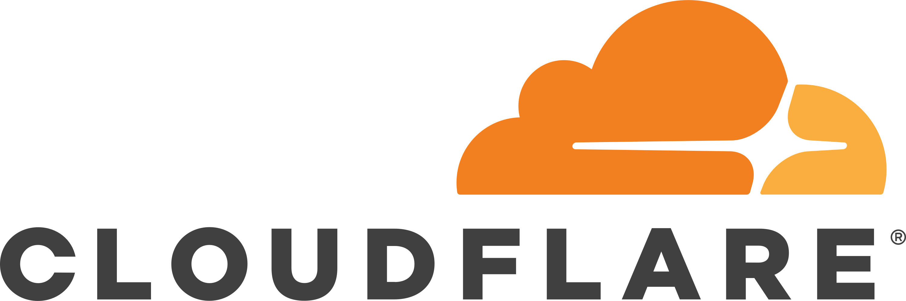
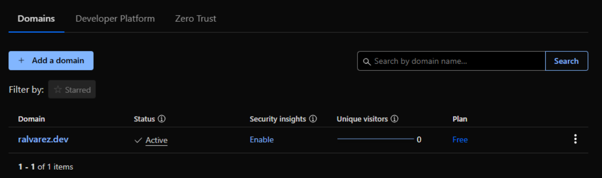
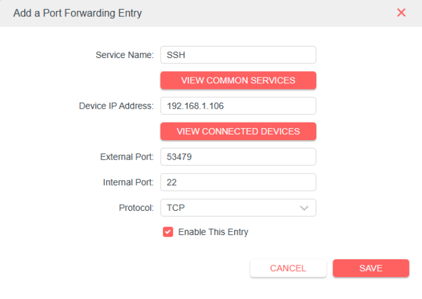
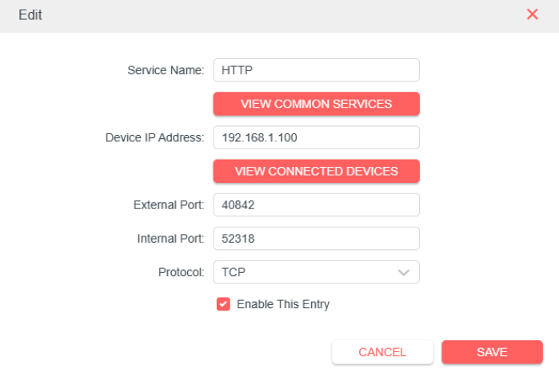
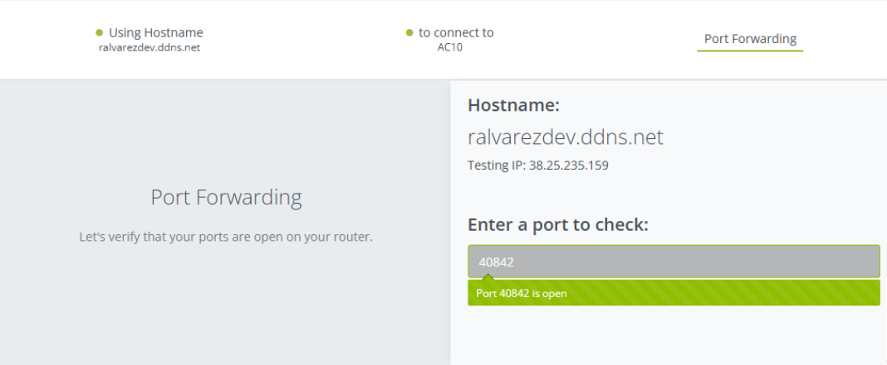
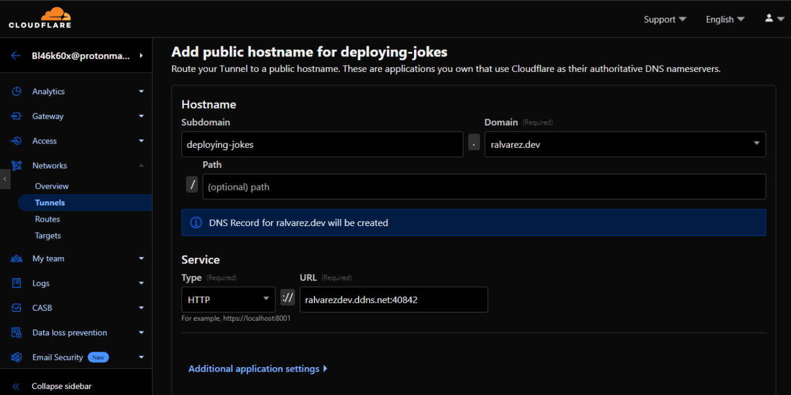

<div class="center">
    
    <i>Logo de Cloudflare</i>
</div>

## Obtención de dominio

Para efectos de este proyecto, se empleó el dominio `ralvarez.dev` obtenido en Cloudflare como base para el acceso externo y la publicación segura de la aplicación, asegurando un control centralizado y profesional sobre el entorno de despliegue.

<div class="center">
    
    <i>Dominio ralvarez.dev</i>
</div>

## Configuración de Red y Acceso Externo

Para permitir el acceso remoto a la aplicación JokeAppWeb desde fuera de la red local, se realizó la configuración de un dominio dinámico mediante la plataforma No-IP, utilizando como dominio principal: `ralvarez.dev`.

Esto facilita el acceso a través de un nombre de dominio en lugar de una dirección IP pública, incluso si esta cambia periódicamente (como suele suceder en conexiones residenciales).

## Asociación de dominio dinámico con IP pública (No-IP)


### Instalación y configuración del cliente No-IP (DUC)

Para mantener actualizada la IP pública asociada al dominio, se instaló el cliente oficial de No-IP DUC (Dynamic Update Client) en el servidor. A continuación, se detallan los pasos ejecutados en un sistema Linux (arquitectura ARM64):

#### Instalación del cliente DUC

```bash
# Descargar el cliente
wget --content-disposition https://www.noip.com/download/linux/latest

# Extraer los archivos
tar xf noip-duc_3.3.0.tar.gz
cd noip-duc_3.3.0/binaries

# Instalar el paquete .deb (en este caso, para arquitectura ARM64)
sudo apt install ./noip-duc_3.3.0_arm64.deb
```

#### Uso del cliente DUC

Ejecutar el programa para iniciarlo:

```bash
noip-duc
```

Iniciar sesión y enviar actualizaciones automáticas:

```bash
noip-duc -g all.ddnskey.com --username <DDNS Key Username> --password <DDNS Key Password>
```

En este paso se utilizaron las credenciales DDNS para autenticar el cliente y vincular el dominio dinámico con la IP pública del servidor.

### Creación de un servicio para ejecutar No-IP DUC automáticamente

Para asegurar que el cliente DUC de No-IP se inicie automáticamente cada vez que el servidor se reinicie, se creó un servicio personalizado de systemd. Esto garantiza que la IP pública se actualice de forma continua sin intervención manual.

#### Pasos realizados

Verificar la ubicación del ejecutable de noip-duc:

```bash
which noip-duc
```

Crear un nuevo archivo de servicio:

```bash
sudo nano /etc/systemd/system/noip-duc.service
```

Contenido del servicio:

```ini
[Unit]
Description=No-IP Dynamic Update Client
After=network.target

[Service]
ExecStart=/usr/bin/noip-duc
Restart=on-failure

[Install]
WantedBy=multi-user.target
```

Recargar systemd y habilitar el servicio:

```bash
sudo systemctl daemon-reexec
sudo systemctl enable noip-duc
sudo systemctl start noip-duc
```

Esto garantiza que noip-duc se ejecute automáticamente al iniciar el sistema.

### Configuración del router (Port Forwarding)

El servicio No-IP no abre puertos automáticamente, por lo que fue necesario realizar la configuración manual del router Mercusys AC10 para habilitar el acceso remoto.

#### Port forwarding para acceso SSH

Se configuró una entrada para redirigir conexiones externas al servicio SSH del servidor:

<div class="center">
    
    <i>Servicio SSH</i>
</div>

Esta configuración permite acceder de forma remota al servidor vía SSH usando el puerto externo 53479, lo cual es una estrategia útil y segura al evitar el puerto 22 por defecto.

#### Port forwarding para acceso HTTP

También se configuró un reenvío de puerto para publicar un servicio HTTP personalizado:

<div class="center">
    
    <i>Servicio HTTP</i>
</div>
Esta configuración indica que se está publicando un servicio web desde un puerto interno (52318) accesible desde Internet a través del puerto externo 40842.

### Verificación del acceso remoto

Tras realizar la configuración de dominio dinámico, port forwarding y ejecución del cliente DUC, se realizó una verificación desde una red externa (por ejemplo, conexión de datos móviles), obteniendo resultados exitosos:

- Se confirmó el enlace de la IP pública `38.25.235.159` al dominio dinámico configurado.
- Se comprobó el acceso a la aplicación web mediante el nombre de dominio.
- Se validó la conectividad remota al servidor vía SSH usando el puerto externo configurado.
- La plataforma de No-IP indicó que la configuración DDNS y de red está funcionando correctamente.

<div class="center">
    
    <i>Verificación del acceso remoto</i>
</div>


## Integración con Cloudflare Tunnel y configuración HTTPS

Con el objetivo de exponer públicamente la aplicación JokeAppWeb de forma segura y profesional a través de un dominio HTTPS, se configuró un túnel mediante la plataforma Cloudflare, aprovechando las funcionalidades de su servicio Cloudflare Tunnel.

Esto permite encapsular el tráfico hacia un servidor en red local (detrás de NAT o sin IP fija), a través de una conexión segura, sin necesidad de exponer directamente la IP pública ni abrir puertos adicionales.

#### Creación de túnel en Cloudflare

La configuración se realizó en la sección Tunnels del panel de control de Cloudflare, dentro del dominio principal `ralvarez.dev`, bajo un proyecto llamado `deploying-jokes`.

<div class="center">
    
    <i>Configuración del cloudflare tunnels</i>
</div>

Este puerto (40842) corresponde al configurado previamente en el router para hacer port forwarding hacia el servidor web interno donde corre la aplicación. La dirección `ralvarezdev.ddns.net` es provista por No-IP, lo que garantiza la continuidad del enlace incluso si la IP pública cambia.

#### Registro DNS

Cloudflare añade automáticamente un registro DNS tipo CNAME o A que vincula `deploying-jokes.ralvarez.dev` con el destino configurado. Esto permite acceder desde cualquier navegador a ese subdominio como si fuera una aplicación en la nube.
