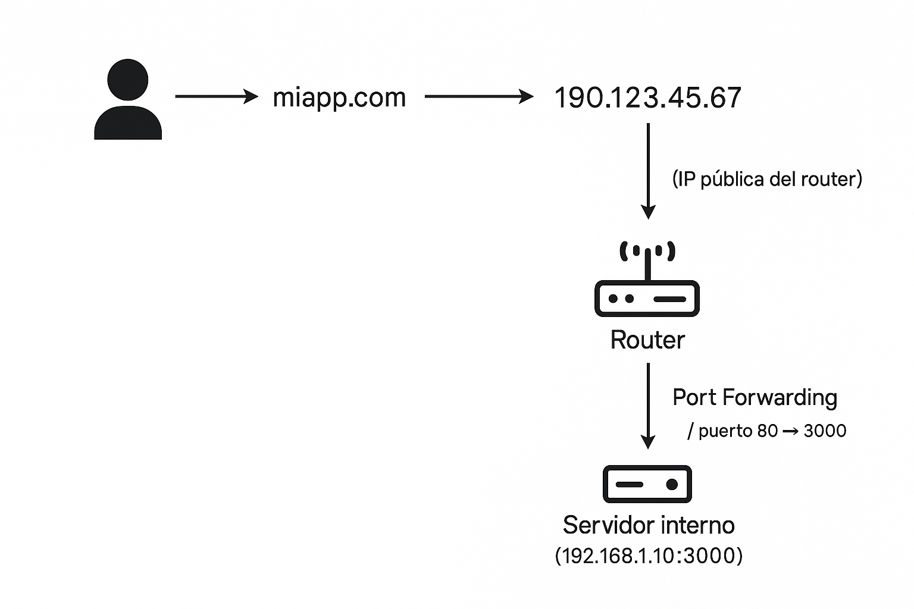

# Port Forwarding, IP Públicas y Dominios

## ¿Qué es el Port Forwarding?

Port forwarding (reenvío de puertos) es una técnica de red utilizada para redirigir solicitudes entrantes desde una IP pública y puerto específico hacia una dirección IP interna en una red privada, y opcionalmente a otro puerto.

En términos simples, permite acceder desde el exterior a servicios alojados dentro de una red privada.

## ¿Para qué sirve?

El port forwarding permite:

- Acceder remotamente a servidores web, SSH, cámaras IP, videojuegos, etc.
- Exponer servicios internos a internet.
- Habilitar administración remota.

### Ejemplos de uso

| Servicio         | IP Interna         | Puerto interno | Puerto externo |
|------------------|--------------------|----------------|----------------|
| Servidor Web     | 192.168.1.100      | 80             | 80             |
| SSH a Raspberry  | 192.168.1.101      | 22             | 2222           |
| Cámara IP        | 192.168.1.50       | 80             | 8080           |

## ¿Dónde se configura?

- En el router que conecta la red local a Internet.
- En firewalls locales (iptables, UFW).
- En servidores o balanceadores cloud (AWS, GCP, Azure).

## ¿Cómo funciona?

1. Un cliente externo realiza una solicitud a la IP pública del router en un puerto específico.
2. El router tiene una regla de port forwarding que redirige esa solicitud a una IP interna y puerto correspondiente.
3. El servicio local responde y el router reenvía la respuesta al cliente.

### Ejemplo

- IP pública del router: `200.45.12.100`
- Port forwarding: `200.45.12.100:80` → `192.168.1.10:3000`
- Resultado: cualquier persona accediendo a `http://200.45.12.100` será redirigida al servicio Node.js corriendo en la red local.

## Tipos de Port Forwarding

1. **Estático**: El puerto externo redirige siempre a la misma IP y puerto interno.
2. **Dinámico**: Se utiliza generalmente con túneles SSH, no con routers domésticos.
3. **Inverso (Reverse Port Forwarding)**: Se abre un túnel desde la red privada hacia una máquina externa, útil si no se puede hacer port forwarding desde el router.

## Seguridad

El port forwarding puede ser riesgoso si se mal configura. Recomendaciones:

- Solo exponer los puertos necesarios.
- Usar puertos no estándar cuando sea posible.
- Configurar firewall (ufw, iptables) para limitar acceso.
- Utilizar autenticación fuerte y cifrado (TLS, SSH).
- Utilizar VPN cuando sea posible.

## Comparación: Port Forwarding vs NGINX

| Característica         | Port Forwarding                     | NGINX                                          |
|------------------------|--------------------------------------|-----------------------------------------------|
| Nivel                  | Red (Capa 3/4)                       | Aplicación (Capa 7)                            |
| Función principal      | Redirigir tráfico basado en puertos  | Servir contenido web, proxy, balanceador       |
| Control                | Limitado: IP y puerto                | Avanzado: dominio, path, headers               |
| Seguridad              | Limitada a firewall                  | TLS, autenticación, control de rutas           |
| Configuración          | En router o firewall                 | En archivo de configuración de NGINX           |
| Casos de uso comunes   | SSH remoto, cámaras IP, servidores   | Proxy inverso, hosting de apps, load balancing |

## Ejemplo Combinado

1. El router reenvía el puerto 443 al servidor web interno: `192.168.1.10:443`.
2. En `192.168.1.10`, NGINX escucha el puerto 443.
3. NGINX, según el dominio solicitado, puede:
   - Servir contenido estático.
   - Redirigir hacia un backend (Node.js, PHP, etc.).
   - Actuar como proxy para múltiples servicios internos.

## Prueba de funcionamiento

1. Configurar la redirección en el router.
2. Verificar que el servicio local esté corriendo.
3. Usar herramientas como `curl`, `telnet`, o navegador desde una red externa.
4. Verificar conexión al puerto público del router.

---

# ¿Qué es una IP Pública?

Una IP pública es una dirección única asignada a un dispositivo o red para permitir el acceso desde cualquier punto de Internet.

## Características

- Asignada por un proveedor de servicios (ISP o nube).
- Visible desde Internet.
- Necesaria para recibir tráfico externo.

### Ejemplos:
- IPv4: `190.123.45.67`
- IPv6: `2800:200:e010::1`

## ¿Para qué sirve?

- Identificar y acceder a servidores o redes desde Internet.
- Recibir solicitudes externas en servicios como HTTP, SSH, VPN, etc.
- Asociar nombres de dominio a direcciones IP para facilitar el acceso.

---

# Relación entre IP Pública, Port Forwarding y Dominios

Supongamos que tienes un servidor web en tu red local.

## Escenario

- Tu proveedor te asigna una IP pública: `190.123.45.67`.
- Tu aplicación web corre en `192.168.1.10:3000` (IP privada).
- Configuras port forwarding: rediriges el puerto 80 del router hacia `192.168.1.10:3000`.

## Acceso mediante dominio

- Registras `miapp.com`.
- Configuras en el DNS que `miapp.com` apunte a `190.123.45.67`.
- Cuando un usuario entra a `http://miapp.com`, el flujo es:
  1. Resolución DNS → IP pública
  2. El router recibe la solicitud
  3. Aplica port forwarding
  4. Redirige al servidor interno
  5. El servidor responde al usuario

## Diagrama

    

---

# Conclusión

Las direcciones IP públicas son fundamentales para que cualquier dispositivo o red pueda ser accesible desde Internet, funcionando como un punto de entrada visible para el mundo exterior. Sin embargo, en la mayoría de los entornos, especialmente en redes domésticas o empresariales, los servicios internos no están directamente expuestos. Aquí es donde entra en juego el port forwarding, que permite redirigir el tráfico entrante desde esa IP pública hacia servicios específicos dentro de la red local, manteniendo un nivel de aislamiento y control.

También, los nombres de dominio desempeñan un papel esencial al ofrecer una forma mucho más amigable de acceder a estos servicios, ya que en lugar de recordar direcciones IP numéricas, los usuarios simplemente pueden escribir un nombre como miapp.com, que será traducido automáticamente a la IP pública correspondiente mediante el sistema DNS.

Unidos, estos elementos como la IP pública, el port forwarding y los dominios forman una arquitectura básica pero poderosa para publicar aplicaciones y servicios locales en Internet. Esta combinación es ampliamente utilizada en soluciones de hosting doméstico, entornos de desarrollo remoto, aplicaciones autoalojadas, dispositivos IoT y más, proporcionando una forma estructurada, accesible y controlada de hacer visibles los recursos internos al mundo exterior.