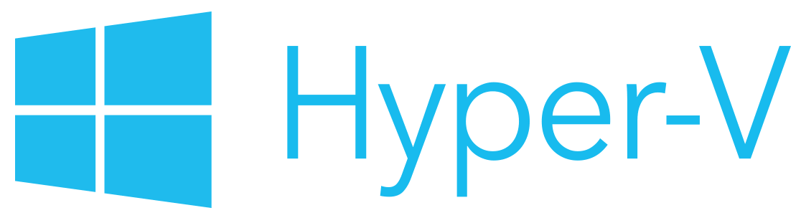
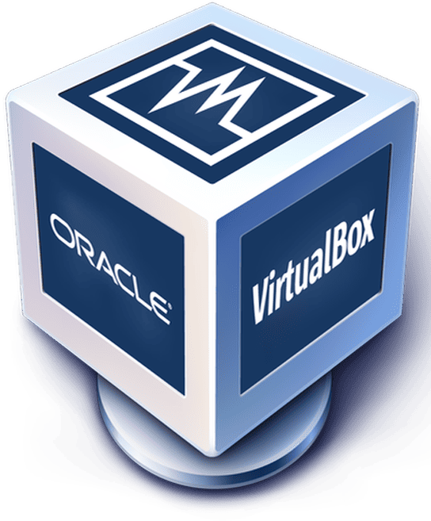

# Máquinas Virtuales (VM) {:#maquinas-virtuales}

## Definición {:#definicion}

	
	<i>Logo de Microsoft Hyper-V</i>

Una **máquina virtual (VM)** es una emulación completa de un sistema operativo que se ejecuta dentro de un entorno virtualizado. Se comporta como un sistema informático independiente, con hardware simulado por software, sobre una computadora física real (host).

## Propósito General {:#proposito-general}

	
	<i>Logo de VMware</i>

Las VM están diseñadas para ejecutar cualquier sistema operativo y software como si fuera un equipo físico, con fines de:

- Laboratorio de pruebas
- Desarrollo de software
- Simulación de redes
- Aislamiento de sistemas
- Seguridad y sandboxing
- Virtualización de escritorios (VDI)

## Componentes Técnicos {:#componentes-tecnicos}

- **Hipervisor (tipo 1 o 2)**
- **Guest OS** (sistema operativo invitado)
- **Disco virtual (VMDK, VHD, QCOW2, etc.)**
- **CPU, RAM, y adaptadores de red virtuales**
- **Controladores de dispositivos virtuales**

## Tipos de Hipervisores {:#tipos-de-hipervisores}

	
	<i>Logo de VirtualBox</i>

| Tipo   | Ejecutado sobre                          | Ejemplos                            |
|--------|------------------------------------------|-------------------------------------|
| Tipo 1 | Directamente en el hardware (bare metal) | VMware ESXi, Microsoft Hyper-V, KVM |
| Tipo 2 | Sobre un sistema operativo anfitrión     | VirtualBox, VMware Workstation      |

## Gestión y Uso {:#gestion-y-uso}

- Se pueden crear, modificar, duplicar, exportar
- Soportan snapshots, clonado, rollback
- Pueden instalar cualquier sistema operativo compatible
- Se administran desde una consola local o remota

## Formatos de Disco Virtual {:#formatos-de-disco-virtual}

| Formato  | Usado por                     | Características                |
|----------|-------------------------------|--------------------------------|
| VMDK     | VMware                        | Compatible con snapshots       |
| VHD/VHDX | Hyper-V, Azure                | Respaldo incremental, cifrado  |
| QCOW2    | KVM/QEMU                      | Compresión, snapshots, cifrado |
| RAW      | Genérico (máximo rendimiento) | Sin metadatos, rápido          |

## Casos de Uso {:#casos-de-uso}

- Laboratorios educativos (ej. redes, hacking ético)
- Testing de múltiples sistemas operativos
- Aislamiento de entornos de desarrollo
- Configuración de clústeres virtualizados
- Simulación de infraestructura compleja
